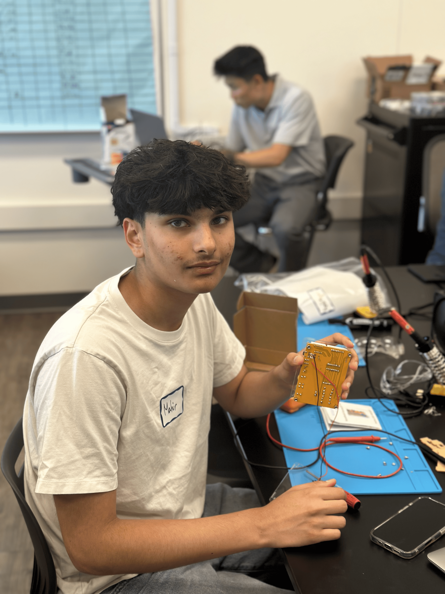

# Optical Character Recognition
This project is a software-based project, ran through a Raspberry Pi. The Raspberry Pi has a camera which takes picutres and can record live feed and broadcast it to our computers. Using the broadcasts from the Raspberry Pi camera, the Raspberry Pi runs a block of code that looks frame-by-frame for words in each frame. If words are found, the code prints a box around the letters it found and also spells out what it found. When building and coding the project, I faced countless challenges. My biggest challenge, however, was trying to code a feed that both broadcasted a smooth live feed to my computer using the Pi Camera, but also detected the letters and words it found in real time speed. When trying to fix this issue, I had two code files; The first one had a very smooth live feed, but was not able to detect letters anc characters in real time. My second code file was able to instantly detect text and words, but the video feed was very glitch and was unlike the first code file. This fix seems to be easy: combine the two files to create both a smooth feed and a real time text detection. However, I faced many problems, and had to have lots of help trying to combine the code segmenets as certain bits of the two do not align with each other.

| **Engineer** | **School** | **Area of Interest** | **Grade** |
|:--:|:--:|:--:|:--:|
| Mahir B | Homestead High School | Mechanical Engineering | Incoming Senior





# Final Milestone

<iframe width="560" height="315" src="https://www.youtube.com/embed/-piw2XX-Xe4?si=_hiuRGgAiChjdANE" title="YouTube video player" frameborder="0" allow="accelerometer; autoplay; clipboard-write; encrypted-media; gyroscope; picture-in-picture; web-share" referrerpolicy="strict-origin-when-cross-origin" allowfullscreen></iframe>

For the third and final milestone of my Optical Character Recognition, I created a program that is able to recognize and highlight text in live camera feeds. Using the code from my second milestone, which was able to detect characters in still and imported images, I altered specific parts to create a live camera feed using the input from my Raspberry Pi camera. Specifically, I added the instantiation of my Rasberry Pi to my original milestone 2 code, in order for the code to use the frames from the live camera rather than the imported image. When completing this task, I ran into lots of challenges. Most notably, I had difficulty creating a live video feed that was not only very smooth (not glitchy), but also able to detect characters in real time, rather than delayed. In overcoming this challenge, I had creating two seperate code segements: one that had an extremely smooth live video feed, but a slow OCR feature, and another that had a quick OCR execution but a very glitchy camera feed. Using these two codes, I tried making a single code that would incoorperate the essentials of each of the individual codes. Though this may seem easy, accomplishing this task was extremely difficult, as many parts of each code would not fit each other when put together, leading me to have to research more about how OCR and live camera feed really work. 

# Second Milestone

<iframe width="560" height="315" src="https://www.youtube.com/embed/gLOUI6KWsCw?si=AAS1u1KE01BpHKdG" title="YouTube video player" frameborder="0" allow="accelerometer; autoplay; clipboard-write; encrypted-media; gyroscope; picture-in-picture; web-share" referrerpolicy="strict-origin-when-cross-origin" allowfullscreen></iframe>

For the second milestone of my Optical Character Recognition project, I focused on creating code that is able to process and detect text in still images that I directly import into my Raspberry Pi files. To do this, I had to create a new code file, which I titled "example.py," and then I followed instructions to create lines of code that would be executed to process the image that I chose. To import the image into my files, I directly downloaded it through my terminal by entering the link to the download. In my code, there is a line of code that resembles which image file you would like to process and find letters in, and I used one that had the word "coffee" in it. When run, this program pops up a window that shows the original "coffee" image, but now the text has a box around it and is the user can clearly see that the program identified this word. However, completing this milestone to it's fullest extent had many road bumps in it. My biggest challenges definitely surrounded environments in python and what they do. When I first ran my code file through the terminal, I recieved an error that told me I had no environment installed. This led me to learn about environments in python and I finally figured out how to create an environment. Essentially, environments are large folders that store all the downloads and files that you create in terminal, so that if you turn the Raspberry Pi off, it will still save the code files that you made and will make them executable.


# First Milestone
<iframe width="560" height="315" src="https://www.youtube.com/embed/k87IMUkZeuk?si=inYRWzS7Dl8RDZRU" title="YouTube video player" frameborder="0" allow="accelerometer; autoplay; clipboard-write; encrypted-media; gyroscope; picture-in-picture; web-share" referrerpolicy="strict-origin-when-cross-origin" allowfullscreen></iframe>

My project is a Optical Character Recognition software that has a camera which looks for characters, and prints what characters the camera saw. To build this project, I first started by setting up my Raspberry Pi, which is the computer that contains the code for the project to work. To set up my Raspberry Pi, I followed a tutorial that helped me compile the parts together for the Pi to work properly, including attatching the Raspberry Pi camera to the motherboard. Then, I connected my Pi to a power source and my computer, and streamed the output of the Pi to a software on my computer called "OBS." My next step was to make the camera take pictures. To do this, I opened a new Python file in my Raspberry Pi software, and entered the proper code to take photos from the camera. These photos are stored as a single file in the Raspberry Pi, meaning each time you take a new photo, that photo overwrites the last photo. Currently, I am in the process of making the camera capture live feed, and brodcast it to my Raspberry Pi. I have found this to be very difficult and have had trouble coding this part.


<!---


# Schematics 
Here's where you'll put images of your schematics. [Tinkercad](https://www.tinkercad.com/blog/official-guide-to-tinkercad-circuits) and [Fritzing](https://fritzing.org/learning/) are both great resoruces to create professional schematic diagrams, though BSE recommends Tinkercad becuase it can be done easily and for free in the browser. 
-->
# Code

```Python
import cv2
import threading
import time
from picamera2 import Picamera2
import pytesseract
from pytesseract import Output
from collections import defaultdict
# If tesseract isn?t in your PATH, uncomment and set the correct path:
pytesseract.pytesseract.tesseract_cmd = '/usr/bin/tesseract'

anagrams = defaultdict(list)
with open('/usr/share/dict/words') as f:
	for w in f:
		w = w.strip().lower()
		if w:
			key = ''.join(sorted(w))
			anagrams[key].append(w)

# Shared OCR results
boxes = []
ocr_lock = threading.Lock()

def ocr_worker(picam2):
	"""Continuously grab frames, run OCR at ~2 Hz, and store detected boxes."""
	global boxes
	while True:
		frame = picam2.capture_array()
		gray  = cv2.cvtColor(frame, cv2.COLOR_BGR2GRAY)

        	# Downscale to speed up OCR, then preprocess
		small = cv2.resize(gray, (320, 240))
		#blur  = cv2.GaussianBlur(small, (5, 5), 0)
		#_, thresh = cv2.threshold(blur, 150, 255, cv2.THRESH_BINARY_INV)

        	# OCR: single-block, LSTM engine
		data = pytesseract.image_to_data(small, output_type=Output.DICT, config="--oem 1 --psm 6" )

		new_boxes=[]
		for i, txt in enumerate(data['text']):
			conf = int(data['conf'][i])
			if conf > 60 and txt.strip():
				raw = txt.strip().lower()
				sig = ''.join(sorted(raw))
				display = anagrams[sig][0] if sig in anagrams else txt

				x = data['left'][i]*2
				y = data['top'][i]*2
				w = data['width'][i]*2
				h = data['height'][i]*2
				new_boxes.append((x,y,w,h,display))

		with ocr_lock:
			boxes = new_boxes
			time.sleep(0.5)

cv2.startWindowThread()
picam2 = Picamera2()
picam2.configure(picam2.create_preview_configuration(main = {"format":'XRGB8888', "size":(640,480)}))
picam2.start()

threading.Thread(target=ocr_worker,args=(picam2,), daemon = True).start()

while True:
	img = picam2.capture_array()

	with ocr_lock:
		current = list(boxes)
	for x,y,w,h,text in current:
		cv2.rectangle(img,(x,y),(x+w,y+h), (0,255,0),2)
		cv2.putText(img, text, (x,y-5), cv2.FONT_HERSHEY_SIMPLEX, 0.5, (0,255,0),1)

	cv2.imshow("OCR Camera", img)
	if cv2.waitKey(1)& 0xFF==ord('q'):
		break
cv2.destroyAllWindows()

```
# Bill of Materials: Optical Character Recognition

| **Part** | **Note** | **Price** | **Link** |
|:--:|:--:|:--:|:--:|
| Raspberry Pi 4 Model B | Your mini Linux computer for DIY projects | $64.99 | <a href="https://www.amazon.com/Raspberry-Model-2019-Quad-Bluetooth/dp/B07TC2BK1X?th=1"> Link </a> |
| 128 GB MicroSD w/ NOOBS | Storage card and easy OS installer | $19.99 | <a href="https://www.amazon.com/SanDisk-256GB-microSDXC-Memory-Adapter/dp/B0B7NV73PJ/ref=sr_1_1_sspa?dib=eyJ2IjoiMSJ9.yNKcpup10tqT9CcKb8PnDULrl_Et5O6A0KgYYEAfNXE7ZdbmJKJVhibcQ6T8EaP_yK-X4LUeL9HHkBLgN6SKL6TGww3sGafspPd_-1WOvT87td_BLjMNneQjHRg89TWjYiAoOycRKej4aJepeN_BrIDdkst9Bhli78oHjeMneNwrP00QVPUaUqHHg2Rwp9uRxC_VDiDcDsYZ4FYHkijCcHX6BK-6VQI4ZQoZc1T7JZ0.OOvu2WH0SQbYyJHKO8izIxLId9V2SdwGSB3Vcd_K77A&dib_tag=se&keywords=micro%2Bsd%2Bcard%2Bnoobs&qid=1751325500&sr=8-1-spons&sp_csd=d2lkZ2V0TmFtZT1zcF9hdGY&th=1"> Link </a> |
| Premium Black Case | Protective shell for the board | $14.95 | <a href="https://www.canakit.com/raspberry-pi-4-case.html?srsltid=AfmBOooYi6ZjCuYShIj1fiSdtXeKgqXhN7H_k-r8y_y2uD8KjGE6VNqZasA&gQT=2"> Link </a> |
| USB-C Power Supply | Stable 5 V power source | $9.99 | <a href="https://www.amazon.com/Security-01-Supply-Adapter-Type-C-MLF-C060503000CU/dp/B09JW4QQJ2/ref=asc_df_B09JW4QQJ2?mcid=70b142077f6d3ba5a4a91c2290eacf52&hvocijid=5006807147904740865-B09JW4QQJ2-&hvexpln=73&tag=hyprod-20&linkCode=df0&hvadid=721245378154&hvpos=&hvnetw=g&hvrand=5006807147904740865&hvpone=&hvptwo=&hvqmt=&hvdev=c&hvdvcmdl=&hvlocint=&hvlocphy=9032183&hvtargid=pla-2281435178338&psc=1"> Link </a> |
| Micro HDMI Cables | Video/audio output to monitors | $5.00 | <a href="https://www.digikey.com/en/products/detail/raspberry-pi/SC0546/13901220?gad_source=1&gad_campaignid=20232005509&gbraid=0AAAAADrbLlhlQMtTm-U4k-e-370-rDh-a&gclid=Cj0KCQjw64jDBhDXARIsABkk8J7HF2_Wec7qWgNTW8mXrj8_PEnmMJJhGvij_OQmyUZKPjKMMEgaiQIaAohNEALw_wcB&gclsrc=aw.ds"> Link </a> |
| USB Card Reader | Plug the MicroSD into another PC | $1.71 | <a href="https://www.digikey.com/en/products/detail/olimex-ltd/USB-CARD-READER/21661975?gad_source=1&gad_campaignid=20476884656&gbraid=0AAAAADrbLlgQNRJooZDGbcnfwpwNdfJO0&gclid=Cj0KCQjw64jDBhDXARIsABkk8J76G5qB_mlHWq3WM25y83snYQbc4KI49_Z3Z22QXElqWKD-j3YYxOkaAkMGEALw_wcB&gclsrc=aw.ds"> Link </a> |
| Raspberry Pi Camera Module 3 | High-resolution camera sensor for photos and video| $25.00 | <a href="https://www.digikey.com/en/products/detail/raspberry-pi/SC1223/17278639?gad_source=1&gad_campaignid=20243136172&gbraid=0AAAAADrbLlg1TS-XsmPOyWTWbG3IDj5kD&gclid=Cj0KCQjw64jDBhDXARIsABkk8J63CVnG0XOs01OUoWEHAgguORU0TDzuxmm2D0jRtcx9m5Zc2gwrUYQaAvwpEALw_wcB&gclsrc=aw.ds"> Link </a> |
| Raspberry Pi Camera Mount | Bracket or clip to hold the camera at the correct angle | $16.95 | <a href="https://www.pishop.us/product/universal-tilt-adjustable-mount-for-raspberry-pi-camera/?gQT=1"> Link </a> |
| Raspberry Pi Case Fan | Small cooling fan to keep the CPU from overheating | $2.95 | <a href="https://www.digikey.com/en/products/detail/adafruit-industries-llc/4468/11587354?gad_source=1&gad_campaignid=20228387720&gbraid=0AAAAADrbLljf_6Xr5Bqlbg3YTqk38m3dD&gclid=Cj0KCQjw64jDBhDXARIsABkk8J5OjrNSsO1X3dhUPB1ivOf88ifyHVWDuAuRugesSnYTQOUtVZdq1hwaAtEtEALw_wcB&gclsrc=aw.ds"> Link </a> |


# Starter Project: Retro Arcade Game Console

<iframe width="560" height="315" src="https://www.youtube.com/embed/o0hxpk1ZnIw?si=7LS6ZI0-IqPjVep9" title="YouTube video player" frameborder="0" allow="accelerometer; autoplay; clipboard-write; encrypted-media; gyroscope; picture-in-picture; web-share" referrerpolicy="strict-origin-when-cross-origin" allowfullscreen></iframe>

This project is a game board that has multiple different games that you can play, such as tetris. It has a start button, an end button, and 4 different buttons to let the user control what happens in the game. It also has a switch that turns the game board on/off. This project helped me gain better soldering skills.

# Schematics 


# Bill of Materials: Retro Arcade Game Console
<!--
Here's where you'll list the parts in your project. To add more rows, just copy and paste the example rows below.
Don't forget to place the link of where to buy each component inside the quotation marks in the corresponding row after href =. Follow the guide [here]([url](https://www.markdownguide.org/extended-syntax/)) to learn how to customize this to your project needs. 
-->

| **Part** | **Note** | **Price** | **Link** |
|:--:|:--:|:--:|:--:|
| Buzzer | Emits sound for alerts or signals | $1.48 | <a href="https://www.digikey.com/en/products/detail/soberton-inc/WST-1206UX/1245302?gad_source=1&gad_campaignid=20243136172&gbraid=0AAAAADrbLlhY9M3nUqqsyarwc_qMKusEt&gclid=CjwKCAjwvO7CBhAqEiwA9q2YJYYXGsf0jUZqDOTA14y7Kia2LQ5VwkYhJalravyX4HI_ZBvEOm5KtRoCokkQAvD_BwE&gclsrc=aw.ds"> Link </a> |
| Electric capacitor | Stores and releases electrical energy | $0.38 | <a href="https://www.digikey.com/en/products/detail/panasonic-electronic-components/EEU-FR1C221/2433527?gad_source=1&gad_campaignid=20228387720&gbraid=0AAAAADrbLljx--os3Oc-ERVDq4RA6mW2A&gclid=CjwKCAjwvO7CBhAqEiwA9q2YJXSsvPe9yKVBAn13_DxdN-5zDTu3uyHwzF0sb70BZF25uVkIMJZKcBoCeCEQAvD_BwE&gclsrc=aw.ds"> Link </a> |
| Micro USB | Connector for power or data transfer from a USB source | $1.02 | <a href="https://www.digikey.com/en/products/detail/kycon-inc/KMMX-BSMT35S-B30TR/9990231?gad_source=1&gad_campaignid=17336967819&gbraid=0AAAAADrbLljQ1XEqeAnpBEhhLVvQ0RmOT&gclid=CjwKCAjwvO7CBhAqEiwA9q2YJch7AeIPcqFWGTiXWI_gwZcN-MZE7zZu-pZeO7V634NsiVUDJxhlQRoCIlQQAvD_BwE&gclsrc=aw.ds"> Link </a> |
| Power cable | Provides power connection from USB to the circuit | $1.15 | <a href="https://www.digikey.com/en/products/detail/cvilux-usa/DH-20M50057/13177527?gad_source=1&gad_campaignid=20232005509&gbraid=0AAAAADrbLlgXi90D88ymrLVEKsdLtkNkH&gclid=CjwKCAjwvO7CBhAqEiwA9q2YJbTsm_A5JxvfvqcYC2h9rqZkQvpnV0xj2wT16m8IkIFdq0Q-0xqFChoCkkcQAvD_BwE&gclsrc=aw.ds"> Link </a> |
| Self-switch | A small momentary push button switch for user input | $1.07 | <a href="https://www.digikey.com/en/products/detail/e-switch/TL2285EE/271569?gad_source=1&gad_campaignid=20243136172&gbraid=0AAAAADrbLlhY9M3nUqqsyarwc_qMKusEt&gclid=CjwKCAjwvO7CBhAqEiwA9q2YJa-6kIjs5HCMdwPaCue7JOGg1PI44C9VrBB7Yniidchfi6TUTHQNUhoC6cIQAvD_BwE&gclsrc=aw.ds"> Link </a> |
| Self-switch Cap (Red) | Cap to fit over the self-switch for easier pressing and visibility | $0.25 | <a href="https://www.digikey.com/en/products/detail/same-sky-formerly-cui-devices-/MPB-CAP-RED/14556566?gad_source=1&gad_campaignid=20243136172&gbraid=0AAAAADrbLlhY9M3nUqqsyarwc_qMKusEt&gclid=CjwKCAjwvO7CBhAqEiwA9q2YJf1uxaHsCm1lSzRANLTquy0r63XtQeYzJLy41eTieDKnc1gyilaC3hoCnQUQAvD_BwE&gclsrc=aw.ds"> Link </a> |
| Digitron display | A 7-segment LED display for showing digits | $4.51 | <a href="https://www.digikey.com/en/products/detail/sunled/XDMDK09A3/21801098?gad_source=1&gad_campaignid=20228387720&gbraid=0AAAAADrbLljx--os3Oc-ERVDq4RA6mW2A&gclid=CjwKCAjwvO7CBhAqEiwA9q2YJTWG6uZAcec10RE_Y8QTXmtksX2l8EnSjktLgyWlL4_EOnQMhR7kdBoCU94QAvD_BwE&gclsrc=aw.ds"> Link </a> |
| IC Chip | Microcontroller that runs the logic and operations | $27.20 | <a href="https://www.aliexpress.us/item/2251832693372901.html?gatewayAdapt=glo2usa4itemAdapt"> Link </a> |
| IC Socket | Holds the IC chip securely and allows easy replacement | $0.98 | <a href="https://www.digikey.com/en/products/detail/cnc-tech/245-40-1-06/3441588?gad_source=1&gad_campaignid=17336967819&gbraid=0AAAAADrbLljQ1XEqeAnpBEhhLVvQ0RmOT&gclid=CjwKCAjwvO7CBhAqEiwA9q2YJaEE7EAQ9kbY6aJvzvN0w15hMq0SKb68H2VarokvrgurUrIN3JvWMhoCTgwQAvD_BwE&gclsrc=aw.ds"> Link </a> |
| LED dot matrix module (2X) | Displays patterns, characters, or graphics using LEDs | $3.81 | <a href="https://www.digikey.com/en/products/detail/visual-communications-company-vcc/VAOM-C07573G9-BW-32/5401808?gad_source=1&gad_campaignid=20228387720&gbraid=0AAAAADrbLljx--os3Oc-ERVDq4RA6mW2A&gclid=CjwKCAjwvO7CBhAqEiwA9q2YJXn_PXWBZLA3mw2nzqcQqXlc0cSRLxA6xLKXLVPM9eL7__775junQhoCXIMQAvD_BwE&gclsrc=aw.ds"> Link </a> |
| Button (6X) | Larger push button for user interaction | $0.49 | <a href="https://www.digikey.com/en/products/detail/omron-electronics-inc-emc-div/B3F-4055/31799?gad_source=1&gad_campaignid=21273973101&gbraid=0AAAAADrbLljrGcWYPDgrPSxEcV5zJ0hcR&gclid=CjwKCAjwvO7CBhAqEiwA9q2YJXpC7uz3mfF-yysd3D4rC-BWNOzcjvKRmDZN4pM5r2x7hMQ6nqY6uRoC8sAQAvD_BwE&gclsrc=aw.ds"> Link </a> |
| Button caps | Protective and ergonomic cover for the button | $5.36 | <a href="https://www.ebay.com/itm/233216074154"> Link </a> |
| PCB | Printed Circuit Board; base for mounting and connecting electronic components | $2.02 | <a href="https://www.aliexpress.us/item/3256803089879308.html?gatewayAdapt=glo2usa4itemAdapt"> Link </a> |
| Screw (M3x5mm)(8X) | Small screws to secure components | $0.15 | <a href="https://www.digikey.com/en/products/detail/keystone-electronics/9904/317325?gad_source=1&gad_campaignid=20228387720&gbraid=0AAAAADrbLljx--os3Oc-ERVDq4RA6mW2A&gclid=CjwKCAjwvO7CBhAqEiwA9q2YJYau_dpmxDqTzByO4yf539yflxUWxrqxz4sTSfBvZAYIuPh3g1chZBoCQgIQAvD_BwE&gclsrc=aw.ds"> Link </a> |
| Screw (M3x8mm)(2X) | Slightly longer screws for mounting thicker parts | $0.19 | <a href="https://www.digikey.com/en/products/detail/keystone-electronics/9907/317328?gad_source=1&gad_campaignid=20228387720&gbraid=0AAAAADrbLljx--os3Oc-ERVDq4RA6mW2A&gclid=CjwKCAjwvO7CBhAqEiwA9q2YJRvSBmfn_zLDGvdnIcv2pafMXud4YzUAjL5VCliUi0KgRi_o0dKz3BoCO8wQAvD_BwE&gclsrc=aw.ds"> Link </a> |
| Copper column (4X) | Standoffs for supporting layers or securing the PCB | $1.43 | <a href="https://www.ebay.com/itm/315725077497"> Link </a> |
| Hexagonal column (4X) | Spacers or supports for separating board layers | $0.97 | <a href="https://www.digikey.com/en/products/detail/keystone-electronics/24307/1532897?gad_source=1&gad_campaignid=20228387720&gbraid=0AAAAADrbLljx--os3Oc-ERVDq4RA6mW2A&gclid=CjwKCAjwvO7CBhAqEiwA9q2YJcp1D4R4r0xNa2w0sAVEdRyKfuvNmSYMxh2qnN33BiqIlB3OFjXDmBoCqAkQAvD_BwE&gclsrc=aw.ds"> Link </a> |
| Battery case | Holds AAA batteries to power the circuit | $1.30 | <a href="https://www.digikey.com/en/products/detail/keystone-electronics/2468/303817?gad_source=1&gad_campaignid=20243136172&gbraid=0AAAAADrbLlhY9M3nUqqsyarwc_qMKusEt&gclid=CjwKCAjwvO7CBhAqEiwA9q2YJT7yRUSi8pDn4UK0BVvVHXu7WxZyQFg1bJuosBaRbvbg7rqIeQi0yxoCc-sQAvD_BwE&gclsrc=aw.ds"> Link </a> |


<!---
# Other Resources/Examples
One of the best parts about Github is that you can view how other people set up their own work. Here are some past BSE portfolios that are awesome examples. You can view how they set up their portfolio, and you can view their index.md files to understand how they implemented different portfolio components.
- [Example 1](https://trashytuber.github.io/YimingJiaBlueStamp/)
- [Example 2](https://sviatil0.github.io/Sviatoslav_BSE/)
- [Example 3](https://arneshkumar.github.io/arneshbluestamp/)

To watch the BSE tutorial on how to create a portfolio, click here.
-->
